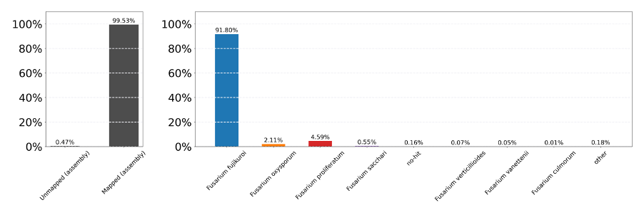

<!----Comments & Links ---->
[RNA-seqLink]:((https://sequencing.qcfail.com/articles/positional-sequence-bias-in-random-primed-libraries/))
<!------------------------->

# Assembly of Foc isolates from TNAU

##### By Jamie Pike

## Contents

- [Data download and QC checks.](#data-download-and-qc-checks)
- [FastQC checks](#fastqc-checks)
- [Bowtie2 Mapping of raw reads](#bowtie2-mapping-of-raw-reads)
- [Searching Unmapped Reads](#searching-unmapped-reads)
  - [Map to _Stenotrophomonas maltophilia_](#map-to-stenotrophomonas-maltophilia)
- [_De novo_ assemblies](#de-novo-assemblies)
  - [Isolate S16](#isolate-s16)
  - [For the S32 and S6 assemblies:](#for-the-s32-and-s6-assemblies)
- [BlobTools Analysis](#blobtools-analysis)

# Data download and QC checks

Isolate raw data supplied on 24/2/23, by Dr Raveendran Muthurajan and downloaded directly from ONEMOMICS via sftp.

>

Isolates sequenced using ONEOMICS using Illumina 1.9 PE (PLATFORM?)

Following download, I assessed the quality of each isolate using FastQC, although a QC html is provided by ONEOMCIS and attached to email from Dr Raveendran Muthurajan.

## FastQC checks

Performed using FastQC (version 0.11.8).

### FASTQ: S6-1.fq.gz

| **GRADE**   | **TEST**   |
| --- | --- |
| PASS  | Basic Statistics  |
| PASS  | Per base sequence quality  |
| PASS  | Per tile sequence quality  |
| PASS  | Per sequence quality scores  |
| FAIL  | Per base sequence content  |
| FAIL  | Per sequence GC content  |
| PASS  | Per base N content  |
| PASS  | Sequence Length Distribution  |
| FAIL  | Sequence Duplication Levels  |
| PASS  | Overrepresented sequences  |
| PASS  | Adapter Content  |

S6-1.fq.gz failed for Per base sequence content, Per sequence GC content and Sequence duplication levels.

**Per base sequence content:**


S6-1.fq has a biased sequence in the first ~12 bases. This is commonly observed in RNAseq analysis, as explained [here][RNA-SeqLink].

### FASTQ: S6-2.fq.gz

| **GRADE**   | **TEST**   |
| --- | --- |
| PASS  | Basic Statistics  |
| PASS  | Per base sequence quality  |
| PASS  | Per tile sequence quality  |
| PASS  | Per sequence quality scores  |
| FAIL  | Per base sequence content  |
| FAIL  | Per sequence GC content  |
| PASS  | Per base N content  |
| PASS  | Sequence Length Distribution  |
| WARN  | Sequence Duplication Levels  |
| PASS  | Overrepresented sequences  |
| PASS  | Adapter Content  |

**Per base sequence content:**


Similarly, S6-2.fq failed for Per base sequence content, Per sequence GC content and Sequence duplication levels and has a biased sequence in the first ~12 bases.

The same was observed for S16 and S32. See the tables below and the HTML outputs:

``/Users/u1983390/Library/CloudStorage/OneDrive-UniversityofWarwick/Research/Genomics/NewToolsProject/Indian-Foc-Genome/Indian Foc Genomes-Feb23/QC-Analysis``

### FASTQ: S16-1.fq.gz

| **GRADE**   | **TEST**   |
| --- | --- |
| PASS  | Basic Statistics  |
| PASS  | Per base sequence quality  |
| PASS  | Per tile sequence quality  |
| PASS  | Per sequence quality scores  |
| WARN  | Per base sequence content  |
| FAIL  | Per sequence GC content  |
| PASS  | Per base N content  |
| PASS  | Sequence Length Distribution  |
| PASS  | Sequence Duplication Levels  |
| PASS  | Overrepresented sequences  |
| PASS  | Adapter Content  |

### FASTQ: S16-2.fq.gz

| **GRADE**   | **TEST**   |
| --- | --- |
| PASS  | Basic Statistics  |
| PASS  | Per base sequence quality  |
| PASS  | Per tile sequence quality  |
| PASS  | Per sequence quality scores  |
| WARN  | Per base sequence content  |
| FAIL  | Per sequence GC content  |
| PASS  | Per base N content  |
| PASS  | Sequence Length Distribution  |
| PASS  | Sequence Duplication Levels  |
| PASS  | Overrepresented sequences  |
| PASS  | Adapter Content  |

### FASTQ: S32-1.fq.gz

| **GRADE**   | **TEST**   |
| --- | --- |
| PASS  | Basic Statistics  |
| PASS  | Per base sequence quality  |
| PASS  | Per tile sequence quality  |
| PASS  | Per sequence quality scores  |
| WARN  | Per base sequence content  |
| FAIL  | Per sequence GC content  |
| PASS  | Per base N content  |
| PASS  | Sequence Length Distribution  |
| FAIL  | Sequence Duplication Levels  |
| PASS  | Overrepresented sequences  |
| PASS  | Adapter Content  |

### FASTQ: S32-2.fq.gz

| **GRADE**   | **TEST**   |
| --- | --- |
| PASS  | Basic Statistics  |
| PASS  | Per base sequence quality  |
| WARN  | Per tile sequence quality  |
| PASS  | Per sequence quality scores  |
| WARN  | Per base sequence content  |
| FAIL  | Per sequence GC content  |
| PASS  | Per base N content  |
| PASS  | Sequence Length Distribution  |
| FAIL  | Sequence Duplication Levels  |
| PASS  | Overrepresented sequences  |
| PASS  | Adapter Content  |

>Raw reads were supplied for S32 and S56 on 16th November 2023. Data were supplied via Transfernow.com from TNAU. No additional information was supplied. I am repeated the FASTQC analysis for these isolates. I am also unsure as to whether S32 is the same isolate/dataset. The Fastq files do have differences, however - guessing that it is the same isolate but sequenced again.

### FASTQ: S32_2/S32-1.fq.gz

| **GRADE**   | **TEST**   |
| --- | --- |
| PASS  | Basic Statistics  |
| PASS  | Per base sequence quality  |
| PASS  | Per tile sequence quality  |
| PASS  | Per sequence quality scores  |
| WARN  | Per base sequence content  |
| WARN  | Per sequence GC content  |
| PASS  | Per base N content  |
| PASS  | Sequence Length Distribution  |
| FAIL  | Sequence Duplication Levels  |
| PASS  | Overrepresented sequences  |
| PASS  | Adapter Content  |

### FASTQ: S32_2/S32-2.fq.gz

| **GRADE**   | **TEST**   |
| --- | --- |
| PASS  | Basic Statistics  |
| PASS  | Per base sequence quality  |
| PASS  | Per tile sequence quality  |
| PASS  | Per sequence quality scores  |
| WARN  | Per base sequence content  |
| WARN  | Per sequence GC content  |
| PASS  | Per base N content  |
| PASS  | Sequence Length Distribution  |
| FAIL  | Sequence Duplication Levels  |
| PASS  | Overrepresented sequences  |
| PASS  | Adapter Content  |

### FASTQ: S56/S56-1.fq.gz

| **GRADE**   | **TEST**   |
| --- | --- |
| PASS  | Basic Statistics  |
| PASS  | Per base sequence quality  |
| PASS  | Per tile sequence quality  |
| PASS  | Per sequence quality scores  |
| WARN  | Per base sequence content  |
| FAIL  | Per sequence GC content  |
| PASS  | Per base N content  |
| PASS  | Sequence Length Distribution  |
| WARN  | Sequence Duplication Levels  |
| PASS  | Overrepresented sequences  |
| PASS  | Adapter Content  |

### FASTQ: S56/S56-2.fq.gz

| **GRADE**   | **TEST**   |
| --- | --- |
| PASS  | Basic Statistics  |
| PASS  | Per base sequence quality  |
| PASS  | Per tile sequence quality  |
| PASS  | Per sequence quality scores  |
| WARN  | Per base sequence content  |
| FAIL  | Per sequence GC content  |
| PASS  | Per base N content  |
| PASS  | Sequence Length Distribution  |
| WARN  | Sequence Duplication Levels  |
| PASS  | Overrepresented sequences  |
| PASS  | Adapter Content  |

---

After speaking to Dr Laura Baxter about the Per base sequence content, she advised not trimming and continuing with assembly. Additionally, she warned me to be careful of the Per sequence GC content, as most do not follow a completely normal distribution and have a very narrow peak in the centre.

---
**From:** Baxter, Laura [Laura.Baxter@warwick.ac.uk](mailto:Laura.Baxter@warwick.ac.uk)
 **Date:** Friday, 24 February 2023 at 15:31
 **To:**  PIKE, JAMIE (PGR) <[Jamie.Pike@warwick.ac.uk](mailto:Jamie.Pike@warwick.ac.uk)>
 **Subject:** Re: FastQC Per base sequence content advice

_Hi Jamie,_

_I agree with what you've found - I often see this not-so-random sequence bias at the start of RNA seq data and don't consider it a problem. It's less common in WGS data but I think essentially it will be the same/similar issue, probably down to the library preparation steps. It would be interesting/useful to know what method/kit they used._

_I wouldn't trim, as they aren't sequencing errors as such, and if you hard trim the first 10 bases you'll lose ~7% your data._

_The per sequence GC content is a bit odd, in that it has a very narrow peak centred around 67% (however, this might be normal for your genome's GC content), but also there's a small 'shoulder' around 50% (again, this might be a biological feature of your genome, if there's say one chromosome with a very different GC content to the rest, or it might be an indicator of reads from different contaminant species being present)._

_I say proceed with the untrimmed data as the quality is high and there's no adapter etc, keeping an eye out for any contaminants._

_Is this fusarium data, and are you doing a de novo assembly, or reference-guided?_

_Cheers,_

_Laura_

---

I continued without trimming, as recommended, and aligned the isolates to the reference quality _Foc_ TR4 assembly from David Studholme's group. I will use the % mapping and blast searching of unmapped reads to gauge the level of contamination and subsequent assembly approach.

# Bowtie2 Mapping of raw reads

In the `Bowtie2Mapping` directory:

Vettel:
``/home/u1983390/Projects/NewTools-Proj/IndianGenomeAssemblies/Bowtie2Mapping``

Bowtie2 version: 2.4.5

An index directory was created for the _Foc_ TR4 reference assembly GCA-007994515.1-UK0001: `UK0001-Index.`

And then the reference assembly was indexed for Bowtie2 using the following command in the conda AlignEnv:

``` bash
bowtie2-build F._oxysporum_f._sp._cubense_UK0001.fna UK0001_bowtie2
```

A directory was created for each isolate within the Bowtie2Mapping directory for the SAM output. The following command was then run for each isolate in the corresponding directory:

``` bash
nohup ../Bowtie2Command.sh [Path/to/fastq_1] [Path/to/fastq_2] 1>Bowtie_S[X].log &
```

The `Bowtie2Command.sh` file contains:

``` bash
#!/bin/bash

One=${1} #Where One is the first fastq.

Two=${2} #Where Two is the second fastq.

python -c "print('=' * 75)"

echo "Bowtie2 Mapping"

echo "---------------"

echo $(date)

python -c "print('=' * 75)"

#Perform Bowtie2 Mapping using UK0001 TR4 as the reference.

bowtie2 --local -x /home/u1983390/Projects/NewTools-Proj/IndianGenomeAssemblies/Bowtie2Mapping/UK0001_Index/UK0001_bowtie2 -1 $One -2 $Two -S ./S16_MappedTo_UK0001.sam

python -c "print('=' * 75)"

#Send email notification of job completion.

SendEmail.py "Bowtie2 Complete" "Bowtie2 Mapping complete. Check for results."

python -c "print('=' * 75)"
```

The Results of BOWTIE2 mapping of raw reads:

**S6**

Command:

```bash
nohup ../Bowtie2Command.sh /home/u1983390/Projects/NewTools-Proj/IndianGenomeAssemblies/rawdata/S6/S6_1.fq.gz /home/u1983390/Projects/NewTools-Proj/IndianGenomeAssemblies/rawdata/S6/S6_2.fq.gz 1>Bowtie2_S6.log &
```

Bowtie2_S6.log:

```bash
==================================================================

Bowtie2 Mapping

---------------

Wed 1 Mar 16:43:38 GMT 2023

==================================================================

26213258 reads; of these:

26213258 (100.00%) were paired; of these:

24042619 (91.72%) aligned concordantly 0 times

1935086 (7.38%) aligned concordantly exactly 1 time

235553 (0.90%) aligned concordantly >1 times

----

24042619 pairs aligned concordantly 0 times; of these:

52956 (0.22%) aligned discordantly 1 time

----

23989663 pairs aligned 0 times concordantly or discordantly; of these:

47979326 mates make up the pairs; of these:

47857196 (99.75%) aligned 0 times

37425 (0.08%) aligned exactly 1 time

84705 (0.18%) aligned >1 times

8.72% overall alignment rate

==================================================================

Sending job status email...

==================================================================
```

**S16**

Command:

```bash
nohup ../Bowtie2Command.sh /home/u1983390/Projects/NewTools-Proj/IndianGenomeAssemblies/rawdata/S16/S16_1.fq.gz /home/u1983390/Projects/NewTools-Proj/IndianGenomeAssemblies/rawdata/S16/S16_2.fq.gz 1>Bowtie_S16.log &
```

Bowtie2_S16.log:

```bash
====================================================================

Bowtie2 Mapping

---------------

Wed 1 Mar 09:36:59 GMT 2023

====================================================================

22473220 reads; of these:

22473220 (100.00%) were paired; of these:

11044640 (49.15%) aligned concordantly 0 times

10676063 (47.51%) aligned concordantly exactly 1 time

752517 (3.35%) aligned concordantly >1 times

----

11044640 pairs aligned concordantly 0 times; of these:

272737 (2.47%) aligned discordantly 1 time

----

10771903 pairs aligned 0 times concordantly or discordantly; of these:

21543806 mates make up the pairs; of these:

20761361 (96.37%) aligned 0 times

552679 (2.57%) aligned exactly 1 time

229766 (1.07%) aligned >1 times

53.81% overall alignment rate

====================================================================

Sending job status email...

====================================================================
```

**S32**

Command:

```bash
nohup ../Bowtie2Command.sh /home/u1983390/Projects/NewTools-Proj/IndianGenomeAssemblies/rawdata/S32/S32_1.fq.gz /home/u1983390/Projects/NewTools-Proj/IndianGenomeAssemblies/rawdata/S32/S32_2.fq.gz 1>Bowtie_S32.log &
```

Bowtie2_S32.log:

```bash
====================================================================

Bowtie2 Mapping

---------------

Wed 1 Mar 14:04:56 GMT 2023

====================================================================

34526189 reads; of these:

34526189 (100.00%) were paired; of these:

29377154 (85.09%) aligned concordantly 0 times

4873959 (14.12%) aligned concordantly exactly 1 time

275076 (0.80%) aligned concordantly >1 times

----

29377154 pairs aligned concordantly 0 times; of these:

124174 (0.42%) aligned discordantly 1 time

----

29252980 pairs aligned 0 times concordantly or discordantly; of these:

58505960 mates make up the pairs; of these:

58215294 (99.50%) aligned 0 times

170055 (0.29%) aligned exactly 1 time

120611 (0.21%) aligned >1 times

15.69% overall alignment rate

====================================================================

Sending job status email...

====================================================================
```

**S56**

S56 to UK0001

```bash
nohup Bowtie2Command.sh /home/u1983390/Projects/NewTools-Proj/data/F._oxysporum_f._sp._cubense_UK0001.fna /home/u1983390/Projects/NewTools-Proj/IndianGenomeAssemblies/rawdata/S56/S56_1.fq.gz /home/u1983390/Projects/NewTools-Proj/IndianGenomeAssemblies/rawdata/S56/S56_2.fq.gz S56_to_UK0001-AllReads 1>S56_to_UK0001-AllReads.log &
```

Output:

```bash
29067204 reads; of these:
  29067204 (100.00%) were paired; of these:
    27923161 (96.06%) aligned concordantly 0 times
    1020806 (3.51%) aligned concordantly exactly 1 time
    123237 (0.42%) aligned concordantly >1 times
    ----
    27923161 pairs aligned concordantly 0 times; of these:
      17875 (0.06%) aligned discordantly 1 time
    ----
    27905286 pairs aligned 0 times concordantly or discordantly; of these:
      55810572 mates make up the pairs; of these:
        55782601 (99.95%) aligned 0 times
        13846 (0.02%) aligned exactly 1 time
        14125 (0.03%) aligned >1 times
4.05% overall alignment rate
[bam_sort_core] merging from 24 files and 1 in-memory blocks...
```

I have now mapped S56 to the _Stenotrophomonas maltophilia_ 44087 C01 reference to check contamination levels for the common contaminant in this data set.

# Searching Unmapped Reads

SAM files were downloaded onto my local machine and converted from SAM to BAM. Unmapped reads were then extracted and searched using the BLAST web server.

Local Path:

```bash
/Volumes/Jamie_EXT/Research/Genomics/NewToolsProject/FocGenomes/Indian_Genomes/Bowtie2Mapping/S*
```

Command example:

```bash
samtools view –S –b S16_MappedTo_UK0001.sam > S16_MappedTo_UK0001.bam

samtools fasta -f 4 S16_MappedTo_UK0001.bam > S16_MappedTo_UK0001_UnmappedReads.fasta

#The fasta file was chuncked using the following command for BLAST searching.

awk 'BEGIN {n=0;} /^>/ {if(n%500==0){file=sprintf("S6_UNmappedReads_UK0001-chunk%d.fa",n);} print >> file; n++; next;} { print >> file; }' < ../S16_MappedTo_UK0001_UnmappedReads.fasta
```

For isolates S6 and S32, the majority of hits were for _Stenotrophomonas_ species, particularly _Stenotrophomonas maltophilia_. A reference assembly for _Stenotrophomonas maltophilia_ was therefore downloaded from GenBank.

## Map to _Stenotrophomonas maltophilia_

Reference Assembly: [GCA_900475405.1](https://www.ncbi.nlm.nih.gov/data-hub/genome/GCF_900475405.1/)

The reference assembly was indexed for Bowtie2 mapping in the following Vettle directory:

``/home/u1983390/Projects/NewTools-Proj/IndianGenomeAssemblies/Bowtie2Mapping/S.maltophilia_44087_C01_Index``

``` bash
bowtie2-build Stenotrophomonas_maltophilia_44087_C01_reference.fna S_maltophilia__ref-bowtie2
```

S6, S16 and S32 were then mapped to the _Stenotrophomonas maltophilia_ reference using the Bowtie2Command.sh file:

```bash
#!/bin/bash

One=${1} #Where One is the first fastq.

Two=${2} #Where two is the second fastq.

python -c "print('=' * 75)"

echo "Bowtie2 Mapping"

echo "---------------"

echo $(date)

python -c "print('=' * 75)"

#Perform Bowtie2 Mapping using S. maltophilia as the reference.

bowtie2 --local -x /home/u1983390/Projects/NewTools-Proj/IndianGenomeAssemblies/Bowtie2Mapping/S.maltophilia_44087_C01_Index/S_maltophilia__ref-bowtie2 -1 $One -2 $Two -S ./S6_MappedTo_S_maltophilia__ref.sam

python -c "print('=' * 75)"

#Send email notifciation of job completion.

SendEmail.py "Bowtie2 Complete" "Bowtie2 Mapping complete. Check for results."

python -c "print('=' * 75)"

S6, S16 and S32 were then mapped to the _Fusarium sacchari_ FS66 reference using the Bowtie2Command.sh file:

#!/bin/bash

One=${1} #Where One is the first fastq.

Two=${2} #Where two is the second fastq.

python -c "print('=' * 75)"

echo "Bowtie2 Mapping"

echo "---------------"

echo $(date)

python -c "print('=' * 75)"

#Perform Bowtie2 Mapping using S. maltophilia as the reference.

bowtie2 --local -x /home/u1983390/Projects/NewTools-Proj/IndianGenomeAssemblies/Bowtie2Mapping/F._fujikuori_FS66_Index/F.fujikuroi-bowtie2 -1 $One -2 $Two | samtools view -Shu | samtools sort -o S32_mappedto_FS66.bam

python -c "print('=' * 75)"

#Send email notifciation of job completion.

SendEmail.py "Bowtie2 Complete" "Bowtie2 Mapping complete. Check for results."

python -c "print('=' * 75)"
```

The following mapping rates are recorded in the corresponding log files.

| Species  | S6 Bowtie2 AlignmentRate  | S16 Bowtie2 AlignmentRate  | S32 Bowtie2 AlignmentRate  | Strain  | GenBank  Accession  | No. of Contigs  | Contig N50 (Mb)  |
|--- |--- |--- |--- |--- |--- |--- |--- |
| F. oxysporum f. sp. cubense (TR4)  | 8.72%  | 53.81%  | 15.69%  | UK0001  | GCA_007994515.1  | 15  | 4.49  |
| F. sacchari  | 5.24%  | 68.65%  | 22.49%  | FS66  | GCA_017165645.1  | 48  | 1.97  |
| Stenotrophomonas maltophilia  | 49.32%  | 0.01%  | 53.93%  | NCTC10258  | GCA_900475405.1  | 1  | 4.5  |

As S6 had a 49.32% mapping rate to the _Stenotrophomonas maltophilia_ reference, unmapped reads were extracted into a fasta file and searched using web BLAST against the NCBI database using the same approach as pg 9 (original BLAST search of unmapped reads).

``/Volumes/Jamie_EXT/Research/Genomics/NewToolsProject/FocGenomes/Indian_Genomes/Bowtie2Mapping/S6/S6_UNmappedReads_S_maltophilia-ChunkedFastas/``

Hits are mixed, with some for _Fusarium_ species, and others for _Stenotrophomonas_ species and _Achromobacter_ species.

The S16 reads which did not map to _FS66_ were extracted and searched against the NCBI database using web BLAST. A lot of the searches had no significant similarity found, which is curious – many of the sequences which did have hits were for _Fusarium_ species. I will therefore generate a _de novo_ assembly for S16 and will then extract the TEF1-a region as well as perform a Blobltools analysis.

# _De novo_ assemblies

### Isolate S16

SPAdes was used to generate the S16 _de novo_ assembly, as it was for the SY-2 assembly prepared in 2022. The SPAdes assembly was generated in the following directory:

``/home/u1983390/Projects/NewTools-Proj/IndianGenomeAssemblies/S16``

Using the following command:

```bash
nohup ./SPAdesAssembly-S16.sh 1>S16_SpadesAssembly.log &
```

Where `SPAdesAssembly-S16.sh` contains:

```bash
#!/bin/bash

#Command used to generate the S16 SPAdes Assembly

python -c "print('=' * 75)"

echo "S16 Spades Assembly"

echo "-------------------"

echo $(date)

python -c "print('=' * 75)"

#Run the Spades command.

spades.py -1 /home/u1983390/Projects/NewTools-Proj/IndianGenomeAssemblies/rawdata/S16/S16_1.fq.gz -2 /home/u1983390/Projects/NewTools-Proj/IndianGenomeAssemblies/rawdata/S16/S16_2.fq.gz --careful –isolate --cov-cutoff auto -o /home/u1983390/Projects/NewTools-Proj/IndianGenomeAssemblies/S16/

python -c "print('=' * 75)"

#Send an email notification of job completion.

SendEmail.py "S16 SPAdes Assembly Complete" "Spades assembly for S16 is now complete. Please check: /home/u1983390/Projects/NewTools-Proj/IndianGenomeAssemblies/S16/ for the results."

python -c "print('=' * 75)"
```

Quality of the S16 assembly was assessed using the following commands:

```bash
nohup ../AssemblyQualityCheck.sh contigs.fasta 1>AssemblyQualityCheck.log &
```

Output can be found in the following directories:

```/home/u1983390/Projects/NewTools-Proj/IndianGenomeAssemblies/S16/QuastResult```

Like the SY-2 assembly, there is not a normal distribution of GC content contigs. Overall GC content is 46.28%. Some contigs have a low GC content. Therefore, alike the SY-2 isolate, low GC contigs were removed using the `gcTrimmer.py` script with a 25% GC threshold.

**BUSCO is 97%.**


After running `gcTrimmer.py`, the gc trimmed fasta was assessed using Quast and BUSCO.

`gcTrimmer.py` command:

```bash
gcTrimmer.py contigs.fasta 25
```

Assembly Quality Check:

```bash
nohup ../AssemblyQualityCheck.sh contigs.fasta_GCcontentAbove25perc.fasta 1>AssemblyQualityCheck_GCTrimmed-25perc.log &
```

In:

``/home/u1983390/Projects/NewTools-Proj/IndianGenomeAssemblies/S16``

The GC trimmed assembly has reduced the number of contigs from 1666 to 768. BUSCO remains at 97.5% and the low GC hip has been removed from the GC% plot. Further, GC% has increased to 47.53.

Next, the raw reads were aligned to the SPAdes GC-Trimmed assembly using Bowtie2.

First, a Bowtie2 index was generated for the SPAdes GC-Trimmed assembly:

```bash
bowtie2-build S16_GC-Trimmed.fasta S16_GC-Trimmed.bowtie2
```

Then the following script and commands used to run Bowtie2:

```bash
nohup ./Bowtie2Command.sh /home/u1983390/Projects/NewTools-Proj/IndianGenomeAssemblies/rawdata/S16/S16_1.fq.gz /home/u1983390/Projects/NewTools-Proj/IndianGenomeAssemblies/rawdata/S16/S16_2.fq.gz 1>Bowtie2_S16RawReads_MappedTo_S16GC-TrimmedAssemb.log &
```

```bash
#!/bin/bash

One=${1} #Where One is the first fastq.

Two=${2} #Where two is the second fastq.

python -c "print('=' * 75)"

echo "Bowtie2 Mapping"

echo "---------------"

echo $(date)

python -c "print('=' * 75)"

#Perform Bowtie2 Mapping using S. maltophilia as the reference.

bowtie2 --local -x /home/u1983390/Projects/NewTools-Proj/IndianGenomeAssemblies/S16/Mapping/Bowtie2Index/S16_GC-Trimmed.bowtie2 -1 $One -2 $Two | samtools view -Shu | samtools sort -o S16RawReads_Mappedto_S16GC-TrimmedAssemb.bam

python -c "print('=' * 75)"

#Send email notifciation of job completion.

SendEmail.py "Bowtie2 Complete" "Bowtie2 Mapping complete. Check for results."

python -c "print('=' * 75)"
```

I then ran Qualimap bamQC to determine coverage etc using the following commands and scripts in the directory below:

``/home/u1983390/Projects/NewTools-Proj/IndianGenomeAssemblies/S16/Mapping/BamQC``

Mean Coverage is 148.8038x - other data can be found:

``/Users/jamiepike/Library/CloudStorage/OneDrive-UniversityofWarwick/Research/Genomics/NewToolsProject/Indian_Foc_Genome/Indian Foc Genomes_Feb23/Assemblies/S16/Mapping``

# BlobTools Analysis

Directory:

``/home/u1983390/Projects/NewTools-Proj/IndianGenomeAssemblies/S16/Blobtools``

The BlobTools analysis was conducted on the _de novo_ S16 assembly to look for contamination, as was performed for the SY-2 isolate.

The BAM input required for BlobTools (raw S16 reads mapped back to assembly) has already been generated, as has the S16 _de novo_ assembly. The preliminary BLAST search required for BlobTools was then conducted using the recommended BLAST search parameters from [BlobTools](https://blobtools.readme.io/docs/taxonomy-file)  and the following command:

```bash
nohup ./BlobtoolsCommand.sh /home/u1983390/Projects/NewTools-Proj/IndianGenomeAssemblies/S16/S16_GC-Trimmed.fasta /home/u1983390/Projects/NewTools-Proj/IndianGenomeAssemblies/S16/Mapping/S16RawReads_Mappedto_S16GC-TrimmedAssemb.bam TNAU_S16 1>BlobtoolsS16.log &
```

Script:

```bash
#!/bin/bash

Assemb=${1?Please provide the assembly input fasta.} #Input Assembly.

Bam=${2?Please provide a bam file of raw reads mapped back to the assembly} #Input BAM.

prefix=${3?Please provide a prefix for you outputs.}

python -c "print('=' * 75)"

echo "Blobtools BLAST"

echo "---------------"

echo $(date)

python -c "print('=' * 75)"

echo "Blasting..."

#Perform BLASTN for Blobtools.

blastn -task megablast -query ${Assemb} -db /shared/reference/NCBI_NT/BLASTDB/nt -outfmt '6 qseqid staxids bitscore std' -max_target_seqs 1 -max_hsps 1 -num_threads 16 -evalue 1e-25 -out ${prefix}.vs.nt.mts1.hsp1.1e25.megablast.out

python -c "print('=' * 75)"

echo "Running Blobtools..."

#Perform the Blobtools Analysis

/home/u1983390/apps/blobtools/blobtools create -i ${Assemb} -b ${Bam} -t ${prefix}.vs.nt.mts1.hsp1.1e25.megablast.out -o ${prefix}.blobtools

echo "Generating Blobtools figures..."

#To view results.

/home/u1983390/apps/blobtools/blobtools view -i ${prefix}.blobtools.blobDB.json -r species

/home/u1983390/apps/blobtools/blobtools view -i ${prefix}.blobtools.blobDB.json -r phylum

#To generate graphs.

/home/u1983390/apps/blobtools/blobtools plot -i ${prefix}.blobtools.blobDB.json -r species

/home/u1983390/apps/blobtools/blobtools plot -i ${prefix}.blobtools.blobDB.json -r phylum

#To generate PDF versions.

/home/u1983390/apps/blobtools/blobtools plot -i ${prefix}.blobtools.blobDB.json -r species --format pdf

/home/u1983390/apps/blobtools/blobtools plot -i ${prefix}.blobtools.blobDB.json -r phylum --format pdf

python -c "print('=' * 75)"

#Send email notifciation of job completion.

SendEmail.py "Blobtools Complete" "Blobtools analysis now complete. Check for results."

echo $(date)

python -c "print('=' * 75)"
```




As all the contigs are from _Fusarium_ using BlobTools, I am wondering if the >25% GC removed contigs are from any contaminants or other phylum_._ I therefore ran BlobTools on the Untrimmed SPAdes assembly.

 The output for the second BlobTools search using all contigs matches the first BlobTools. Most of the sequences are from _F. fujikuroi._ Interestingly, only 0.55% of the reads are from _F. saccahri._ I will conduct a _TEF-1a_ and _RPBII_ phylogeny and Fusariod DB search to try and work out what species this may be. I think the high _F. fujikuroi_ hits is because of bias in the BLAST nt DB on Vettel.

### For the S32 and S6 assemblies

I am going to try to create a _de novo_ assembly for S32 using the same SPAdes command and approach to see what the BlobTools results are. If I get a lot of hits for the higher GC contigs looking like the bacterial species, I can try to filter those out using the `gcTrimmer.py` script.

The BlobTools results indicate a fair amount of contamination, but the majority of assembled hits are for _F. fujikori –_ as 20% of the reads mapped to FS66, I am going to extract these into a fastq and create a _de novo_ SPAdes assembly from that. I'll then search and extract the _TEF1-a_ and _RBPII_ regions to see if it looks like _F. saccahri._


This whole process (_de novo_ assembly from all reads, blobtools, _de novo_ assembly from _F. saccahari_ mapped reads) will also be performed for S6.

---

## Generating the S32 and S6 assemblies from mapped reads

First i created the FASTQ files using the script `FastqFromMapped.sh` and commands below:

```bash

# S32

nohup FastqFromMapped.sh NewToolsProject/exp/GenomeAssemblies/S32/Mapping/Mapping_Assembly_S32-FS66MappedReads/S32RawReads_mappedto_S32SPAdesAssembly_FS66Reads.sorted.bam S32-FS66_ 1>FastqFromMapped_S32-FS66.log &

# S6

```

Then, I generated the assemblies using the ``SPAdesAssembly.sh`` shell script.

```bash
#  S32 
# I ran in the following directory NewToolsProject/exp/GenomeAssemblies/S32/SPAdesAssemblies/SPAdesAssembly_FS66Reads

nohup SPAdesAssembly.sh  /home/u1983390/Projects/NewTools-Proj/IndianGenomeAssemblies/S32/S32-FS66_Fastqs/S32-FS66_Mapped.1.fastq /home/u1983390/Projects/NewTools-Proj/IndianGenomeAssemblies/S32/S32-FS66_Fastqs/S32-FS66_Mapped.2.fastq  S32-FS66Reads 1>../SPAdesAssembly_FS66Reads.log &

# S6

```

I renamed the fasta and copied it to the FASTA_Version directory.

```bash

mv contigs.fasta SPAdesAssembly_FS66Reads.fasta        

mkdir -p ../../FASTA_versions 

cp SPAdesAssembly_FS66Reads.fasta    ../../FASTA_versions/S32_V3-SPAdesAssembly_FS66Reads.fasta 

# I also copied the previous two assemblies to the FASTA_versions directory at this point and renamed the files. I repeated this for all of the assemblies so i could keep track of the versions going forward.
```

I then repeated the BlobTools analysis. I had updated the Bowtie2Command.sh script at this point:

```bash
#!/bin/bash

#Script to map fastq files to a reference. 
#Builds the index, performs mapping and notifies when complete. 
#Miniconda AssemblyEnv should be activated. 

#To exit if any of the pipeline fails. 
set -e

#Set the variables
Ref=${1? Please eneter a reference Assembly.} #Reference Assembley for mapping
One=${2?Please provide the fastq 1.} #Where One is the first fastq.
Two=${3?Please provide the fastq 2.} #Where two is the second fastq.
Prefix=${4?Please provide an output prefix} #Prefix for outputs


if [ "$CONDA_DEFAULT_ENV" = "AssemblyEnv" ]; then #Check the conda environment is correct.
    python -c "print('=' * 78)"
    echo "Bowtie2 Mapping"
    echo "---------------"
    echo $(date)
    echo "Usage: Bowtie2Command.sh <reference fasta> <fastq_1> <fastq_2> <output prefix>"
    python -c "print('=' * 78)"
    echo "Building Bowtie2 Index..."
    #Make Ouput Directory for index
    mkdir ${Prefix}_Bowtie2Index
    #Build the index 
    bowtie2-build ${Ref} ${Prefix}_Bowtie2Index/${Prefix}.Index >${Prefix}_Bowtie2-Build.log

    echo "Performing Bowtie2 Alignment..."
    #Perform Bowtie2 Mapping using S. maltophilia as the reference.
    bowtie2 --local -x ./${Prefix}_Bowtie2Index/${Prefix}.Index  -1 $One -2 $Two | samtools view -Shu | samtools sort -o ${Prefix}.sorted.bam 

    python -c "print('=' * 78)"
    #Send email notifciation of job completion.
    SendEmail.py "Bowtie2 Complete" "Bowtie2 Mapping complete for ${Prefix}. Check for results."
    python -c "print('=' * 78)"      
else
    echo "You have not activated the conda environment."
    exit 1
fi

```

```bash
nohup Bowtie2Command.sh home/u1983390/NewToolsProject/exp/GenomeAssemblies/S32/FASTA_/versions/S32_V3-SPAdesAssembly_FS66Reads.fasta home/u1983390/Projects/NewToolsProject/exp/GenomeAssemblies/rawdata/S32/S32_1.fq.gz home/u1983390/Projects/NewToolsProject/exp/GenomeAssemblies/rawdata/S32/S32_2.fq.gz S32RawReads_mappedto_S32SPAdesAssembly_FS66Reads 1>Mapping_Assembly_S32-FS66MappedReads.log &
```

I then performed the BlobTools anaylsis with `BlobtoolsCommand.sh`.

```bash
nohup BlobtoolsCommand.sh /home/u1983390/Projects/NewTools-Proj/IndianGenomeAssemblies/S32/SPAdesAssembly_FS66Reads.fasta /home/u1983390/Projects/NewTools-Proj/IndianGenomeAssemblies/S32/Mapping/S32RawReads_mappedto_S32SPAdesAssembly_FS66Reads.bam TNAU_S32-FS66ReadsAssembly 1>Blobtools.log &
```

Once the BlobTools analysis was finsihed, I removed contigs identified as belonging to other, recognised genera using the `ContaminantFilter.sh` script.

```bash
#!/bin/bash

#Jamie Pike
#Command for filtering conatminant blobtools hits. This groups all of the standard BlobTools commands I used to remove a contaminat contigs analysis. 

python -c "print('=' * 75)"
echo "Blobtools Contaminant Filter"
echo "----------------------------"
echo $(date)
echo "Usage: ContaminantFilter.sh <FASTA file> <blobtools json file> <outfile prefix>"
python -c "print('=' * 75)"

infile=${1?Please provide the assembly input fasta.} #Input Assembly.
json=${2?Please provide a BlobTools json file.} #Input BAM.
prefix=${3?Please provide a prefix for you outputs.} 

########################
#Escape the script if there are any errors. 
set -e 

echo "Creating species table..."
#Use BlobTools view to generate a blobtools table.txt file for filtering.
blobtools view -i ${json} -r species -o ${prefix}

echo "Filetering for Fusarium and no-hit only contigs..."
#Use grep to extact only the Fusarium and no-hit lines from the hit table.
grep -E 'Fusarium|no-hit' ${prefix}*.table.txt > ${prefix}.FusariumHits.table.txt

echo "Generating list file..."
#Create a list of the Fusarium and no-hit only contigs. 
awk '{print $1}' ${prefix}.FusariumHits.table.txt >  ${prefix}.FusariumHits.list.txt

echo "Generating contaminant filtered fasta..."
#Create a list of the Fusarium and no-hit only contigs. 
blobtools seqfilter -i ${infile} -l ${prefix}.FusariumHits.list.txt -o ${prefix}.ContaminantFiltered

echo "Generating contaminant sequences fasta..."
#Create a list of the Fusarium and no-hit only contigs. 
blobtools seqfilter -v -i ${infile} -l ${prefix}.FusariumHits.list.txt -o ${prefix}.ContaminantSequences

echo "ContaminantFilter.sh finished."
echo $(date)
echo "+++++
It is advisable that you check the number of contigs in the ${prefix}.ContaminantFiltered.fasta matches the number of lines in the ${prefix}.FusariumHits.table.txt file."
python -c "print('=' * 75)" 
```

I ran the `ContaminantFilter.sh` script with the following inputs on the command-line:

```bash
nohup ContaminantFilter.sh /home/u1983390/Projects/NewTools-Proj/IndianGenomeAssemblies/S32/SPAdesAssembly_FS66Reads.fasta TNAU_S32-FS66ReadsAssembly.blobtools.blobDB.json ContamFilter 
```

The filtered output FASTA was then copied to the FASTA Versions directory and used for subsequent analysis.

```bash

cp S32_FS66-ContaminantFiltered.fasta ../../FASTA_versions/S32_V4-_FS66-ContaminantFiltered.fasta
```
